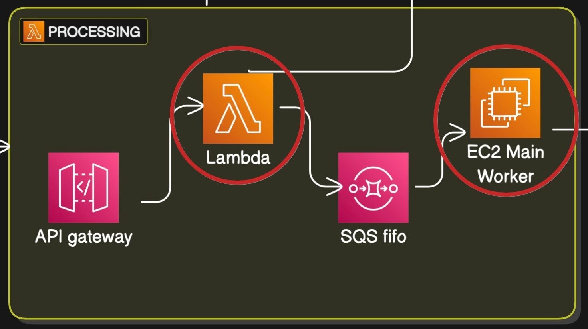

# XYOM

- "XY" stands for _coordinates_, and "OM" stands for _Online Morphometrics_.

- The geometric morphometrics tools can be used in a wide range of fields, though many of its users come from an entomological background.

- XYOM currently offers its UI in four different languages: English, French, Spanish, and Thai, although the analysis reports are available only in English.

## Current Stack

- TypeScript
- Node.js
- React
- Terraform

## Cloud Architecture

### Lambda function

This function is responsible for orchestrating the following tasks:

1. **Creating a New Analysis Request**: Inserts a new analysis request record into `DynamoDB` to track the request lifecycle.
2. **Uploading Metadata to `S3`**: Uploads a `request.json` file to an `S3` bucket, detailing the analysis type and the `S3` directory where the user has uploaded their input data.
3. **Publishing to `SQS`**: Sends a message to an `SQS` queue containing the `S3` path for further processing.

The `SQS` subscriber is a Node.js-based handler deployed within a Docker container running on an `EC2` instance.

This Lambda function, previously implemented in Node.js with TypeScript, is now implemented in Rust. You can find its code [here](https://github.com/dujas/xyom-lambda-request-r).

### User Flow

- When users visit [xyom.io](https://xyom.io), they can either create an account using an email and password or sign up with an existing identity provider (currently only Google).
- Once logged in, users have two main workflows: **Analysis** and **Digitization**.

##### Analysis

XYOM provides multiple analyses, with the main ones being:

- **Characterization**
- **Classification**
- **Identification**

Each of these includes a set of analyses widely used in geometric morphometrics. For more information and detailed explanations, please refer [here](http://xyom-clic.eu/xyom-analyzes/).

##### Digitization

Users can upload their images and use the digitization UI to add plots (called `landmarks`) to the images. They can then collect these landmarks in various formats (CLIC, TPS, CSV) for use with the analyses mentioned above.

The digitization UI offers three types of landmark collection:

1. **Landmarks digitization** (the most standard method)
2. **Outlines or pseudo-landmarks**
3. **Semi-landmarks**

### Rust & XYOM

The idea is to move two main backend sections implemented in NodeJS with TypeScript to Rust. The first section is the one mentioned above the

1. **"xyom lambda function"** and you can find its implementation [here](https://github.com/dujas/xyom-lambda-request-r).
2. **"xyom main worker"** is a Node.js-based handler deployed within a Docker container running on an `EC2` instance.

##### xyom Main Worker

This handler is responsible for the following tasks:

1. **Subscribing to an `SQS` Queue**: Listens for messages from the designated `SQS` queue.
2. **Accessing Metadata in `S3`**: Uses the message received to retrieve the `request.json` file from the specified `S3` bucket.
3. **Executing the Analysis**: Processes the analysis as specified in the `request.json` file.
4. **Saving the Analysis Response**: Stores the analysis results in the same `S3` directory as a `response.json` file.
5. **Updating `DynamoDB` Status**: Updates the corresponding `DynamoDB` record status to either `DONE` or `ERROR`, based on the outcome of the analysis.
