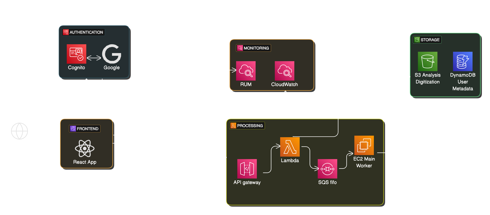

# XYOM

- "XY" stands for _coordinates_, and "OM" stands for _Online Morphometrics_.

- The geometric morphometrics tools can be used in a wide range of fields, though many of its users come from an entomological background.

- XYOM currently offers its UI in four different languages: English, French, Spanish, and Thai, although the analysis reports are available only in English.

## Current Stack

- TypeScript
- Node.js
- React
- Terraform

## Cloud Architecture

### User Flow

- When users visit [xyom.io](https://xyom.io), they can either create an account using an email and password or sign up with an existing identity provider (currently only Google).
- Once logged in, users have two main workflows: **Analysis** and **Digitization**.

#### Analysis

- XYOM provides multiple analyses, with the main ones being:

  - **Characterization**
  - **Classification**
  - **Identification**

  Each of these includes a set of analyses widely used in geometric morphometrics. For more information and detailed explanations, please refer [here](http://xyom-clic.eu/xyom-analyzes/).

#### Digitization

- Users can upload their images and use the digitization UI to add plots (called `landmarks`) to the images. They can then collect these landmarks in various formats (CLIC, TPS, CSV) for use with the analyses mentioned above.

- The digitization UI offers three types of landmark collection:
  1. **Landmarks digitization** (the most standard method)
  2. **Outlines or pseudo-landmarks**
  3. **Semi-landmarks**
